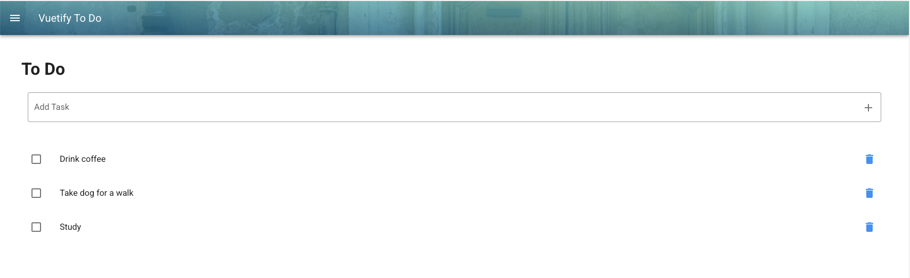
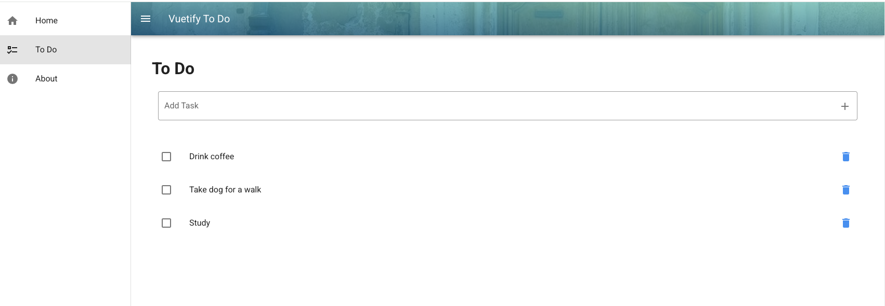

# vuetify-app

Project is to practice and discover the various Vuetify components by creating a To Do App. 

https://vuetifyjs.com/en/

### To Do App Features

* Menu 
* Navigation 
* Lists
* Routes 
* Functionality - Add a Task, Complete, Delete 

Practice is from Udemy - Create a Gorgeous Todo App with Vuetify 2, Vue JS 2 & Vuex - using many different Vuetify Components! (Legacy Course)

Instructor: Danny Connell


## Project setup
```
yarn install 
```
or

```
npm install
```

### Compiles and hot-reloads for development
```
yarn serve
```
or 

```
npm run serve
```

### Compiles and minifies for production
```
yarn build
```

### Customize configuration
See [Configuration Reference](https://cli.vuejs.org/config/).

### Screenshots



